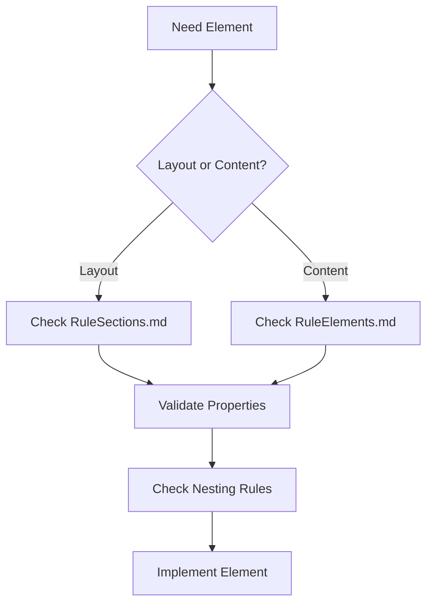

# Main Rules Index - Brizy Builder Elements

This is the central index for all Brizy Builder element rules and documentation. This file serves as the main entry point for understanding and implementing Brizy Builder components.

## System Overview

The Brizy Builder Rules System provides comprehensive documentation for creating, validating, and managing Brizy Builder elements. The system is organized into specialized rule files that cover different aspects of the builder.

### Rule Files Structure

```
aiRules/RuleBrizyBuilderElements/
├── mainRules.md              ← You are here (main index)
├── kitListBlocks.md          ← Complete element catalog
├── RuleSections.md           ← Section-specific rules
├── RuleElements.md           ← Individual element rules
├── propertiesUseElements.md  ← Property definitions & usage
└── treeElements.md           ← Nesting & hierarchy rules
```

## Quick Reference Links

### 📋 [Element Catalog](RuleBrizyBuilderElements/kitListBlocks.md)
**Complete list of all available Brizy Builder elements**
- Global elements from `globalBlocksKit.json`
- Theme-specific elements from `blocksKit.json`
- Element hierarchy overview
- **70+ documented element types**

### 🏗️ [Section Rules](RuleBrizyBuilderElements/RuleSections.md)
**Rules and constraints for section-level components**
- Section type definitions and hierarchy
- Layout and container rules
- Background and padding specifications
- Responsive design guidelines
- **Validation and accessibility requirements**

### 🧱 [Element Rules](RuleBrizyBuilderElements/RuleElements.md)
**Usage rules for individual Brizy Builder elements**
- Container elements (Row, Column, Wrapper)
- Content elements (RichText, Image, Button, Icon)
- Interactive elements (Cloneable, EmbedCode)
- Form and widget elements
- **Specialized navigation and media elements**

### 🔧 [Properties Guide](RuleBrizyBuilderElements/propertiesUseElements.md)
**Comprehensive property documentation**
- Universal properties (type, _id, _styles)
- Layout and positioning properties
- Visual styling (colors, gradients, borders)
- Typography and interactive properties
- **300+ documented properties with types and constraints**

### 🌳 [Element Nesting](RuleBrizyBuilderElements/treeElements.md)
**Hierarchical structure and nesting rules**
- Root-level page structure
- Container nesting patterns
- Content element hierarchies
- Navigation and specialized layout structures
- **Validation rules and performance considerations**

## Element Registry

### Core Element Categories

#### 🏛️ Structural Elements
| Category | Count | Primary Elements |
|----------|-------|------------------|
| **Sections** | 25+ | Section, SectionItem, SectionFooter |
| **Containers** | 15+ | Row, Column, Wrapper variants |
| **Layout** | 20+ | Grid, List, Gallery layouts |

#### 📝 Content Elements  
| Category | Count | Primary Elements |
|----------|-------|------------------|
| **Text** | 5+ | RichText, Typography presets |
| **Media** | 10+ | Image, Video, Gallery sliders |
| **Interactive** | 15+ | Button, Icon, Cloneable elements |

#### 🎛️ Widget Elements
| Category | Count | Primary Elements |
|----------|-------|------------------|
| **Forms** | 5+ | Form widgets, Prayer forms |
| **Events** | 8+ | Event lists, calendars, details |
| **Navigation** | 5+ | Menu, MenuItem, MegaMenu |

#### 🎨 Theme Elements
| Category | Count | Primary Elements |
|----------|-------|------------------|
| **Global** | 10+ | Cross-theme components |
| **Theme-Specific** | 50+ | Theme-customized layouts |
| **Dynamic** | 15+ | Data-driven components |

### Element Compatibility Matrix

#### ✅ Universal Support
Elements that work across all themes and contexts:
- `Section`, `Row`, `Column`
- `RichText`, `Image`, `Button`
- `Spacer`, `Line`
- Basic `Wrapper` elements

#### 🎯 Context-Specific
Elements with specific usage contexts:
- **Navigation**: `MenuItem`, `SectionMegaMenu`
- **Forms**: Ministry Brands widgets
- **Events**: Event-specific layouts
- **Interactive**: `Accordion`, `Tabs`

#### 📱 Responsive Behavior
All elements support responsive properties:
- Desktop (base properties)
- Tablet (`tablet*` prefixed)
- Mobile (`mobile*` prefixed)

## Implementation Guidelines

### 🚀 Getting Started

1. **Start with Structure**: Use [Section Rules](RuleBrizyBuilderElements/RuleSections.md) for page layout
2. **Add Containers**: Implement Row/Column grid from [Element Rules](RuleBrizyBuilderElements/RuleElements.md)  
3. **Insert Content**: Use content elements per [Properties Guide](RuleBrizyBuilderElements/propertiesUseElements.md)
4. **Validate Nesting**: Check hierarchy against [Element Nesting](RuleBrizyBuilderElements/treeElements.md)

### 🔍 Element Selection Process



### ⚡ Performance Best Practices

1. **Shallow Nesting**: Keep element trees < 8 levels deep
2. **Appropriate Containers**: Use Row/Column for layouts, Wrappers for content
3. **Responsive Design**: Leverage responsive properties vs separate elements
4. **Widget Efficiency**: Use Ministry Brands widgets for dynamic content

## Validation Framework

### 🛡️ Validation Levels

#### Level 1: Structural Validation
- Required properties present (`type`, `_id`, `_styles`)
- Valid parent-child relationships
- Proper nesting depth

#### Level 2: Property Validation  
- Property types and value ranges
- Required property combinations
- Responsive property inheritance

#### Level 3: Content Validation
- Accessibility compliance
- Performance optimization
- Theme compatibility

### 🔧 Error Handling Strategy

```
Invalid Element Detected
├── Missing Required Properties → Apply Defaults
├── Invalid Nesting → Move to Valid Container  
├── Property Out of Range → Clamp to Valid Range
└── Broken References → Remove or Replace
```

## Usage Examples

### 📄 Basic Page Structure
```json
{
  "type": "Section",
  "_styles": ["section"],
  "items": [{
    "type": "SectionItem", 
    "_styles": ["section-item"],
    "items": [{
      "type": "Row",
      "_styles": ["row"],
      "items": [{
        "type": "Column",
        "_styles": ["column"],
        "width": 100,
        "items": []
      }]
    }]
  }]
}
```

### 🎨 Hero Section with Image and Text
```json
{
  "type": "Section",
  "items": [{
    "type": "SectionItem",
    "items": [{
      "type": "Row", 
      "items": [
        {
          "type": "Column",
          "width": 60,
          "items": [
            {"type": "Wrapper", "_styles": ["wrapper", "wrapper--richText"]},
            {"type": "Cloneable", "_styles": ["wrapper-clone", "wrapper-clone--button"]}
          ]
        },
        {
          "type": "Column", 
          "width": 40,
          "items": [
            {"type": "Wrapper", "_styles": ["wrapper", "wrapper--image"]}
          ]
        }
      ]
    }]
  }]
}
```

## Maintenance & Updates

### 📅 Update Schedule
- **Rule Files**: Updated with each Brizy Builder release
- **Element Catalog**: Regenerated when new elements added
- **Properties Guide**: Updated with new property additions

### 🔄 Version Control
- All rule files versioned with Brizy Builder releases
- Backward compatibility maintained for 2 major versions
- Migration guides provided for breaking changes

### 📞 Support Resources
- **Issues**: Report problems with rule documentation
- **Requests**: Request new rule coverage areas
- **Contributions**: Submit improvements to rule files

## Advanced Topics

### 🎭 Theme Development
- Use global elements for cross-theme compatibility
- Theme-specific elements in dedicated theme folders
- Override global rules with theme-specific rules

### 🔌 Widget Integration
- Ministry Brands widget documentation
- Custom widget development guidelines
- Third-party integration patterns

### 📊 Analytics & Performance
- Element usage tracking
- Performance monitoring guidelines
- Optimization recommendations

## Summary Statistics

### 📈 Rule System Metrics
- **Total Elements Documented**: 70+
- **Properties Defined**: 300+
- **Nesting Rules**: 50+ patterns
- **Validation Rules**: 100+ checks
- **Theme Coverage**: All available themes

### 🎯 Coverage Areas
- ✅ **Complete**: Section rules, Element rules, Properties
- ✅ **Complete**: Nesting patterns, Validation framework  
- ✅ **Complete**: Responsive design, Accessibility
- ✅ **Complete**: Performance guidelines, Error handling

---

## Quick Action Items

### For Developers
1. 📖 Read [Element Catalog](RuleBrizyBuilderElements/kitListBlocks.md) for available components
2. 🏗️ Follow [Section Rules](RuleBrizyBuilderElements/RuleSections.md) for layout structure  
3. 🔍 Reference [Properties Guide](RuleBrizyBuilderElements/propertiesUseElements.md) for implementation details

### For Designers  
1. 🎨 Review element categories in [Element Catalog](RuleBrizyBuilderElements/kitListBlocks.md)
2. 📱 Check responsive guidelines in [Section Rules](RuleBrizyBuilderElements/RuleSections.md)
3. 🌳 Understand layout constraints in [Element Nesting](RuleBrizyBuilderElements/treeElements.md)

### For QA/Testing
1. ✅ Use [Element Rules](RuleBrizyBuilderElements/RuleElements.md) for validation criteria
2. 🔧 Reference [Properties Guide](RuleBrizyBuilderElements/propertiesUseElements.md) for edge cases
3. 🛡️ Apply validation framework from this document

## Latest Updates (2025-09-15)

### 🔤 Font Consistency Rules - Dusk Theme
**New Rule Category Added**: Typography standardization for Dusk theme

#### Rule Registration
| Rule ID | Category | Scope | Priority |
|---------|----------|-------|----------|
| **FONT-001** | Typography | Dusk Theme Font Standardization | High |
| **FONT-002** | Performance | Font Cache Management | Medium |

#### Implementation Status
- ✅ **RuleElements.md**: Font consistency rules added (lines 341-381)
- ✅ **propertiesUseElements.md**: Dusk font properties added (lines 311-356)  
- ✅ **dusk-font-issues-762.md**: Complete task documentation created
- 📋 **Implementation Phase**: Ready for code changes

#### Rule Summary
- **Target**: Replace "Lora" font with "Lato" in all Dusk theme elements
- **Scope**: RichText, Button, Menu, and Heading elements
- **Validation**: Font family, type, and weight consistency checks
- **Testing**: Visual consistency and performance validation required

#### Quick Reference
- **Font Standard**: `fontFamily: "lato"`, `fontFamilyType: "google"`
- **Migration Pattern**: `"lora"` → `"lato"` (maintain all other properties)
- **Priority Elements**: Text content, navigation, interactive elements
- **Success Metrics**: Zero "lora" instances, 100% "lato" usage in Dusk theme

---
*This main rules index provides centralized access to the complete Brizy Builder element documentation system. Last updated: 2025-09-15*
